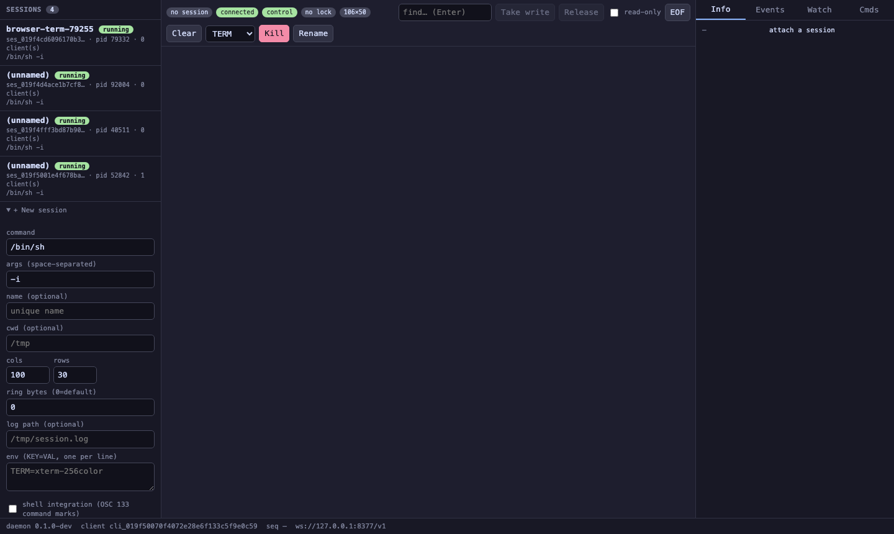

# terminal-playground

**Use case:** a full web control panel for a runbaypty daemon — a real xterm.js terminal plus UI for nearly every capability the daemon exposes over its WebSocket. It's the test bench: spawn sessions, drive them, watch the event stream, arm regex watches, inspect OSC 133 command blocks, toggle read-only, and watch it auto-reconnect — all from a browser, all against the live protocol.

Where [browser-terminal](../browser-terminal/) shows the *smallest* path to a browser terminal, this shows the *widest*.



## Run it — one command

From this directory:

```sh
task play
```

That builds the daemon, starts an **isolated** daemon (its own home, socket, and WS port `8388` — so it won't collide with any daemon you're already running), serves the UI, and opens it in your browser at `http://127.0.0.1:9098/`. `ctrl-c` stops the web helper; the daemon (and its sessions) keep running. When you're done:

```sh
task stop     # stop the isolated daemon and clean its state
task logs     # tail the daemon log
```

From the repo root instead: `task -d examples/terminal-playground play`.

## Run it — manually

If you already have a daemon running (e.g. `runbaypty serve --ws-port 8377`), point the helper at its home:

```sh
bin/runbaypty serve --ws-port 8377 &
RUNBAYPTY_HOME=<daemon-home> go run ./examples/terminal-playground
# open the printed URL, e.g. http://127.0.0.1:9099/
```

Flags: `--addr` (default `127.0.0.1:9099`), `--ws-port` (the daemon's WS port, default `8377`). The helper reads the daemon's tokens from `RUNBAYPTY_HOME`, so that must point at the same home the daemon uses.

## Testing walkthrough

Once the page loads (pills go **connected** / **control**, the sidebar lists sessions):

1. **Spawn** — in the left "+ New session" panel, tick **shell integration (OSC 133)** and click **Spawn**. It spawns `/bin/sh -i` and auto-attaches; you'll see a `$` prompt.
2. **Take the keyboard** — click **Take write** in the toolbar (pill turns green **writing**). Until you hold the write lock, typing is refused — that's the single-writer model.
3. **Type** — click the terminal and run e.g. `echo hello-$((6*7)); ls /`. You'll see `hello-42` and a colorized `ls`.
4. **Watch the panels** (right side): **Info** (live SessionInfo), **Events** (lifecycle stream — silence, activity, resized, command-finished), **Watch** (add a regex like `hello-[0-9]+`, then echo a matching line to see live matches), **Cmds** (OSC 133 blocks with exit codes + Replay).
5. **Read-only** — tick the toolbar checkbox: it reconnects with the read-only token, typing is blocked, and Take/Release grey out (enforced by the daemon).
6. **Resize** — drag the browser window; the PTY resizes (a `resized` event fires and the dims pill updates).
7. **Kill / Rename / EOF / search** — the rest of the toolbar. Search finds text in the scrollback (type in the find box, Enter).

First load needs network (xterm.js comes from a CDN).

## What it exercises

Every panel maps to real protocol frames — this is a working demonstration that the whole surface is reachable from a hand-written client.

| Area | UI | Frames used |
|---|---|---|
| **Handshake** | connection + scope pills, daemon/client id in the status bar | `HELLO` / `HELLO_ACK` |
| **Session list** | left sidebar, live via the event stream | `LIST` / `LIST_OK` |
| **Spawn** | new-session form: cmd, args, name, cwd, cols/rows, ring bytes, log path, env, OSC 133 shell integration | `SPAWN` / `SPAWN_OK` |
| **Attach** | click a session; scrollback replays; `last_seq` shown | `ATTACH` / `ATTACH_OK`, `DETACH` |
| **Output** | the xterm terminal (colors, cursor, full-screen apps render — raw bytes, real emulator) | `OUTPUT` |
| **Input** | type into the terminal (requires the write lock) | `INPUT`, `INPUT_EOF` |
| **Resize** | fit-to-container + `ResizeObserver`; dims pill | `RESIZE` |
| **Write lock** | Take / Release buttons, holder shown in Info | `TAKE_WRITE` / `RELEASE_WRITE` |
| **Kill / Rename** | signal picker + buttons | `KILL`, `RENAME` |
| **Info** | live `SessionInfo`: pid, state, bytes in/out, seq, subscribers, lock holder, fg process | `INFO` / `INFO_OK` |
| **Events** | all-session lifecycle stream (created, exited, silence, activity, bell, resized, attached, command-*) | `SUBSCRIBE_EVENTS`, `EVENT`, `EXIT` |
| **Watch** | arm an RE2 regex on the current session; live matches with seq + matched text | `WATCH` / `WATCH_OK`, `WATCH_EVENT` |
| **Cmds** | OSC 133 command blocks with exit codes + byte ranges; replay last command | `EVENT` (command-*), `REPLAY_COMMAND` / `REPLAY_COMMAND_OK` |
| **Read-only** | toggle reconnects with `token.ro`; typing blocked, controls disabled | scope enforcement daemon-side |
| **Resilience** | auto-reconnect with backoff; resumes the attach at `last_seq` and re-arms watches | `ATTACH{since_seq}` |

## How it's built

Same thin-helper pattern as [browser-terminal](../browser-terminal/): the Go process serves **one** page and injects the daemon's tokens (both control and read-only) into it. The browser then speaks the wire protocol to the daemon's WebSocket **directly** — the helper is never in the data path and holds no terminal state. Keep it bound to loopback; it hands out real tokens.

The page reimplements the protocol client in ~500 lines of dependency-free JavaScript:

- **Framing** — the same `[u32 len][u8 type][u16 headerLen][header JSON][payload]` encode/decode as [raw-protocol-node](../raw-protocol-node/), one frame per binary WS message.
- **Request/reply** — a `call()` that stamps a `req_id` and returns a Promise settled by the matching reply (or rejected by an `ERROR` echoing that `req_id`). Pushes (`OUTPUT`, `EVENT`, `EXIT`, `WATCH_EVENT`) carry no `req_id` and route to the panels.
- **Reconnect + resume** — on socket close it re-dials with exponential backoff, re-`HELLO`s, re-`ATTACH`es at the tracked `last_seq` (zero-gap, the [follow-resilient](../follow-resilient/) behavior in the browser), re-subscribes to events, and re-arms watches. The read-only toggle uses this same path to re-scope the whole connection.

## OSC 133 shell integration

Tick "shell integration" in the spawn form and the helper seeds `PROMPT_COMMAND` + `PS1` so the shell emits OSC 133 marks. The daemon's scanner turns those into `command-started` / `command-finished` events, which populate the **Cmds** panel with per-command exit codes and output byte ranges — the same primitive Warp's "blocks" are built on. Replay pulls the last command's output window via `REPLAY_COMMAND`.

## Security notes

- The helper serves **both** tokens to the page so the read-only toggle can demonstrate scope enforcement. That means anyone who can load the page gets control scope. Bind it to loopback (the default) and don't expose it.
- Read-only is enforced by the **daemon**, not the page: flipping the toggle reconnects with `token.ro`, and the daemon refuses every control verb on that scope regardless of what the page's JavaScript tries (see [read-only-share](../read-only-share/)).

## Next

- [browser-terminal](../browser-terminal/) — the minimal version, if you just want a terminal in a tab
- [raw-protocol-node](../raw-protocol-node/) — the framing and request/reply this page is built on
- [read-only-share](../read-only-share/) — the scope enforcement the read-only toggle relies on
- [session-dashboard](../session-dashboard/) — the event-driven session list, as a standalone Go example
